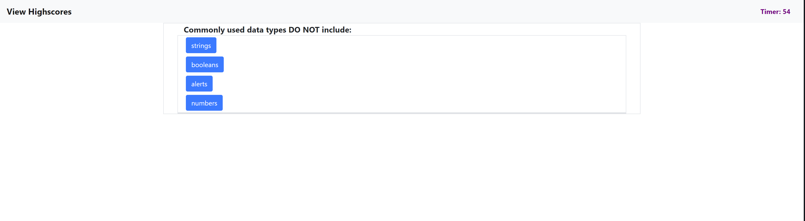

# code-quiz

## Description

For this project, the goal was to create a quiz application that challenged users through a series of questions within a alloted time limit.

Below are links to the webpage and the github repository for my code-quiz application:

Github Pages URL: <https://rajdeep24.github.io/code-quiz/>

Github Repository: <https://github.com/rajdeep24/code-quiz>

## Table of Contents

- [Installation](#installation)
- [Usage](#usage)
- [Credits](#credits)
- [License](#license)

## Installation

No installation required. Simply view the application by clicking on the following link:

<https://rajdeep24.github.io/Raj-Kakar-Portfolio/>

## Usage

To run quiz application, press the start button on the home page. You will then see a series of questions and answer options. Click on the correct answers within the alloted time. Incorrect selections will deduct 10 seconds the time. Once the series of questions have been completed, save your score and initials to see where you rank amongst others.

### Screenshots

## Credits

I would like to credit my peers, instructors, and teacher assistants from the GT bootcamp. They were an integral part in providing the essential knowledge and guidance needed to accomplish this task. Additionally, I would like to thank my tutor, Kevin Ferguson.

## License

Feel free to leverage the code to learn how to build a quiz application using Javascript, HTML, CSS, and bootstrap.

---

## Badges

